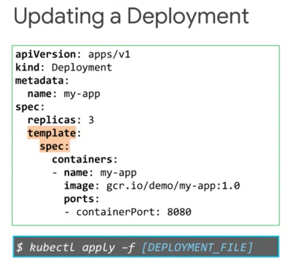

# MLOps (Machine Learning Operations) Fundamentals

In this notes we introduce machine learning operations or MLOps for short it's concepts, terminology in components. We start by providing an overview of why in when to employ MLOps. In the main pain points addresses. Then we will provide an introduction to kubernetes components such as Docker containers, pods, namespaces, clusters in container registry's. These will prepare you for a good understanding of AI pipelines using Q flow, so you will learn how to use Q flow pipelines to orchestrate the amount pipelines you build. Feel free to skip this module if you already familiar with such concepts. Then we discuss the phases of machine learning project in the context of a pipeline and also look at how to scale pipeline development with Google Cloud. Finally, we will cover Q Flow pipelines in detail, Q flow pipelines is an open source machine learning platform that was designed to enable the use of machine learning pipelines to orchestrate complicated workflows running a Kubernetes.

## Why and When to Employ MLOps

### Data Scientist's Pain Points

Let's look at machine line you from an operations perspective. This means taking a whole system view from defining the problem to scaling the solution. Let's just start by discussing the current challenges data scientists face when operationalizing their models and making them available in production. 

Some of the things we hear from data scientists are 

> "Keeping track of the meaning models we have trained is difficult"

They want to keep track of the different versions of the code, the values they chose for the different hyper parameters in the metrics they're evaluating. They have trouble keeping track of which ideas had been tried, which ones worked and which ones did not. They cannot pinpoint the best model, which is possibly trained two previously, reproduce it, and run it on full production data. 
**Reproducibility** is a major concern because there are scientists who want to be able to rerun the best model with a more through parameter sweep. 

Putting a model in production is difficult unless it can be reproduced, because many companies have that as a policy or requirements. When the team is able to successfully train a model and make it ready for production usage in a streamline fashion performance and agility are considerably improved. 

Additionally, for a production application, the model needs to be updated on a regular basis as new data comes in, so traceability becomes paramount. Given all the barriers that data scientists face today. What can be done to mitigate them? Maybe you should examine a machine learning project, the way an operations person would. In a row, you consider the whole system in terms of time, resources, and quality. How do you reduce the time between <u>analyzing the problem, creating the models and deploying the solution, while maintaining the quality of the output.</u> In software engineering, this approach called DevOps. We can borrow the term in machine learning and call it **MLOps.**

### Machine Learning Life Cycle

Think of MLOps as a lifecycle management discipline for machine learning. Its goal is a balanced process for approach to the management of resources, data, code, time, and quality to achieve business objectives in meet regulatory concerns. 

Some of the concepts from DevOps translate directly to MLOps. 

1. Continuous Integration (CI)

When software developers work on a project, they don't all work on the same code at the same time. Instead, they check out the code they intention workout from a code safe, they merge it back with their task is finished. Before the code is returned to the safe, the developer checks that nothing has changed in the main version and then unit test the updates before merging the code back together. The more frequently these changes are merged with the main code, the less chance that is of divergence. This process is called Continuous Integration or CI. In a busy development team, this happens tens of times a day.

2. Continous Delivery (CD)

Another process favored by developers is Continuous Delivery or CD. This is a method for building, testing in releasing software in short cycles. Done this way, the main development code is almost always production ready, it can be released into the light environment at anytime. If it is not done this way, the main code is like a race car with its wheels off and its engine out, you can go fast, but only after is put back together. Continuous delivery can be done either manually or automatically.

3. Continuous Training (CT)

Continuous integration of source code, unit testing, integration testing in continuous delivery of the software to production, or important processes in machine learning operations too. But there is another important aspect to MLOps, that's right, **data**. Unlike conventional software that can be relied on to do the same thing every time on the ML model, can go off. By this we mean that its projective power wins as data profile changes, which they inevitably do. So we can build on continuous integration and continuous delivery, and introducing new term Continuous Training or CT. 

Continuous training is the process of monitoring, measuring, retraining and serving the models. MLOps differs from DevOps in important ways too. Continuous integration is no longer only about testing, invalidating code and components, but also about testing and invalidating data, data schemas and models. It is no longer about a single software package or service, but a system. The ML training pipeline that should automatically deploy another service, the model prediction service. Uniquely, ML is also concerned with automatically monitoring, retraining and serving the models. Another concept that transfers well from software development machine learning is technical debt. Software developers are familiar with time, resources, and quality trade offs. They talk about technical debt, which is the backlog of free work that builds up, because sometimes they have to compromise on quality in order to develop code quickly. They understand that, although there may have been good reasons to do this, they have to go back and fix things later. This is an engineering version of the common saying, putting off until tomorrow what is better than today, there is a price to pay. Machine learning could arguably be considered the high interest credit card of technical debt. These means that developing and deploying in the ML system can be relatively fast and cheap, but maintaining it overtime can be difficult and expensive. The real challenge isn't building an ML model, it is building an integrated an ML system and continuously operating it in production. Just like a high interest credit card, that technical debt with machine learning compounds, it can be incredibly expensive and difficult to pay down. Machine learning systems can be thought of as a special type of software system. So operationally they have all the challenges of software development, plus a few of their own. Some of these include, multi-functional teams, because ML projects will probably have developers in data scientists working on data analysis, model development and experimentation. Much in functional teams can create it all management challenges. Machine learning is experimental in nature. You must constantly try new approaches with the data, the models, and parameter configuration. The challenge is tracking what worked and what didn't in maintaining reproducibility while maximising causerie usability. Another consideration is attaching and the mouse system is more involved than passing other software systems. Because you're validating data, parameters, and code together in a system instead of unit testing methods and functions. ML systems deployment isn't a simple as deploying enough line train, ML Model as production service. ML systems can require you to deploy a multistep pipeline to automatically retrain and deploy models. And finally, concerns with concept drift and consequent model decay should be addressed. Data profiles constantly change, if something changes in the data input, the projective power of the modeling production will likely change with it. Therefore you need to track summary statistics of the data and monitor the online performance of your model to send notifications, or rollback with values deviate from your expectations. Technical batch builds up in the ML system for many reasons. So we'll be looking at ways to mitigate that throughout this course.

### MLOps Architecture and TensorFlow Extended COmponents

Now it is time to go over the main phases of a machine learning lifecycle and map them to the components or tasks within MLOps. When we look at machine learning projects, we identify three main phases:

1. A discovery phase,
2. A development phase, and
3. A deployment phase. 

- **Discovery Phase**

Identifying the business need in its use case allows for a clear plan of what a machine learning model will help us achieve. This phase is crucial because it will <u>establish the problem or task that needs to be solved and how solving it will affect the business and the users consuming the product or solution argumented by machine learning.</u>

 This phase is also when data exploration happens, recognizing why datasets are needed, whether the needed data is readily available and sufficient to train a model, and whether external datasets would be beneficial and how to acquire them. 
 
 All of these are considerations that involve the data exploration step. Then, depending on the tests to be performed, an algorithm is chosen by the data science team. The combination of data availability in algorithm along with the decision of buying versus building the solution, becomes an important consideration for feasibility assessment where the team tries to uncover any problems that may arise during the development phase.
 
  One example is that for the specific use case and question, 
  
  > the data is available historically but not for inference time
  
  In that case, the particular scenario might make the use case <u>infeasible</u> for ML and the more through analysis may have to be performed before the use case can be pursued further. 
  
  Another aspect of the discovery phase is <u>prioritizing the different use cases that the business has that can become potential ML projects, but that discussion is out of the scope of this course.</u> 
  
  - **Development Phase**

  Now, for the development phase, you may ask, 
  
  - How does development start on this chart during data exploration? 
  - Shouldn't we wait until the result of the feasibility study?
  - What happens in reality is that even for data exploration and algorithms selection, some proofs of concept will need to be developed, and that is what we refer to here. After the feasibility assessment gives the go-ahead, the real development starts. 
  
  > All the data steps such as cleaning, extracting, analyzing, and transforming, will be implemented during the data pipeline creation. 
  
  The data pipeline evolves:
  
  1. ensuring that all the operation is needed on the data for both offline and streaming, for training and reference also will be performed consistently to avoid the rescue.
  2. After the data is ready, building and evaluating the model begins. I say begins because these steps may need a couple of iterations until the data scientist is happy with the results and ready to present them to the main stakeholders.
  3. Considerations include, the use case should be revisited because the learning algorithm isn't capable of identifying patterns on the data for that task. Data should be revisited because the model either needs more of it or needs additional aspects and your features maybe from the existing data. Some additional transformations are needed to improve the model quality. Or even a different algorithm is perceived as a better choice. There are numerous possibilities. This iteration will happen as many times as needed until the model reaches the desired performance. 
  
**Deployment Phase**

  After results are presented and stakeholders are satisfied with how the model is performing, it is time to plan for model deployment. This is when the following questions will likely arise. 
  
  - Which platform should host my model? 
  - Which service should I pick for model serving?
  - How many loads should the cluster have so you can scale and take care of all the demand in a cost effective manner?
  
   Operationalizing and monitoring the model will allow for maintainability and avoiding model decay, as we discussed. Having a strategy in place to detect concepts of data drifts will allow signaling when the model should be retrain or data should be adjusted or argumented. Ensuring that your pipeline considers all the necessary tasks for health checks and alerts is the most effective way to avoid your satisfaction from the user's consuming your models projections. 
   

   Focusing on the development and the deployment phases, we see that they have multiple steps. 
   
1. For data exploration, for example, that is 

    - data extraction,
    - data analysis, and
    - data preparation.

2. The model building comprise a 
    - streaming,
    - evaluation, and
    - validation. 

3. Deployment requires hosting the train model and serving it and having a prediction service ready to handle requests. 
   
4.  Monitoring to allow for continuous evaluation and training based on the performance results at a given point.

#### The level of automation of this steps define the maturity of the ML process

Which reflects the velocity of training your model is giving you data, or training your model is giving new validations. 

1. Level 0 - Build and deploy manually

    - Many ML professionals build and deploy the ML models manually. We call this maturity level zero. 
    
2. Level 1 - Automate the training phase

    - All the data scientists perform continuous training of their models by automating the ML pipeline. This is maturity Level 1. 
    
3. Level 2 - Automate training, validation, and deployment

    - Finally, the most mature approach completely automates and integrates the ML training, validation, and deployment phases. This is maturity Level 2. 
    
You and your team have probably begun or still are at maturity Level 0 and that's nothing to worry about. Our goal here is to help you automate your processes and move up the automation ladder with the suite of tools and services available at Google Cloud.

## Containers and Kuberetes

The next topic is about Kubernetes components such as docker, containers, pods, name spaces, clusters, and container registries. These concepts provide the basis to better understand later modules that talk about AI pipelines using Kubeflow, where you will learn how to orchestrate the ML pipelines you build. We understand that some of you may already know Kubernetes and GKE in great detail. Therefore, we are making this an optional module.

### Containers

#### Key features of containers 
#### The advantages of using containers for application deployment compared to alternatives such as deploying apps directly to virtual machines

A more efficient way to resolve the dependency problem is to implement abstraction at the level of the application and its dependencies. You don't have to virtualize the entire machine or even the entire operating system, but just the user space. Again, the user space is all the code that resides above the kernel, and includes the applications and their dependencies. This is what it means to create containers. Containers are isolated user spaces per running application code. 

Containers are lightweight because they don't carry a full operating system, they can be scheduled or packed tightly onto the underlying system, which is very efficient. They can be created and shut down very quickly because you're just starting and stopping the processes that make up the application and not booting up an entire VM and initializing an operating system for each application. 

### Kubernetes

Kubernetes is a popular container management and orchestration solution. It's a container centric management environment. It automates the deployment scaling, load balancing, logging, monitoring, and other management features of containerized applications. 
- Kubernetes also facilitates the features of an infrastructure as a service, such as allowing a wide range of user preferences and configuration flexibility. 
- Kubernetes job is to make the deployed system conform to your desired state and then keep it there in spite of failures. 
- Because the system is desired state is always documented, it also reduces the risk of error.

**Kubernetes Features:**

1. Support both stateful and stateless apllications
2. Autoscaling
3. Resource limits
4. Extensibility

#### Google Kubernetes Engine

Google cloud's managed service offering for Kubernetes is called Google, Kubernetes Engine or GKE. 

**Google Kubernetes Engine (GKE)**

It will help to <u>deploy, manage and scale Kubernetes environments for containerized applications on GCP</u>. More specifically, GKE is a component of the GCP compute offerings. It makes it easy to bring your Kubernetes workloads into the cloud. 

When you use GKE, you start by directing the service to instantiate a Kubernetes system for you. This system is called a <u>**cluster**</u>. GKE's auto upgrade feature can be enabled to ensure that your clusters are automatically upgraded with the latest and greatest version of Kubernetes. The virtual machines that host your containers inside of a GKE cluster are called <u>**nodes**</u>. 

#### Compute Options Detail

Computing options available in GCP:

1. Compute Engine: offers virtual machines that run on GCP.
    - Fully customizable virtual machines
    - Persistent disks and optional local SSDs
    - Global load balancing and autoscaling
    - Per-second billing
2. GKE: is an orchestration system for applications in containers. It automates deployment, scaling, load balancing, logging, and monitoring, and other management features.
3. App Engine: is a good choice if you simply want to focus on writing code, and you don't want to worry about building the highly reliable and scalable infrastructure that'll run on.
4. Cloud Run:  is serverless, it distracts way all the infrastructure management so you can focus on developing applications.
5. Cloud Functions:  is serverless, it distracts way all the infrastructure management so you can focus on developing applications.

## Kubernetes Architectures

### Kubernetes Concepts

To understand how Kubernetes works, there are two related concepts you need to understand. 

1. The first is the Kubernetes object model. 
    - Each thing Kubernetes manages is represented by an object. You can view and change these objects, attributes, and state. 

    

2. The second is the principle of declarative management
    - Kubernetes expects you to tell it what you want, the state of the objects under each management to be.

### Kubernetes Control Plane

- First and foremost, your cluster needs computers. Nowadays, the computers that compose your clusters are usually virtual machines.
- One computer is called the master and the others are called simply, nodes. 
    + The job of the nodes is to run pods. 
    + The job of the master is to coordinate the entire cluster. 
- The single component that you interact with directly is the kube-APIserver. 
    + This component's job is to accept commands that view or change the state of the cluster, including launching pods. 
- Etcd is the cluster's database. 
    + Its job is to reliably store the state of the cluster. 
    + This includes all the cluster configuration data and more dynamic information such as what nodes are part of the cluster, what pods should be running, and where they should be running. You never interact directly with etcd.

## Deployment and Jobs

### Deployments

Deployment subscriber desired state of pods, for example, a desire state could be that you want to make sure that 5 engine X pods are running at all times. It's declared of sense means that Kubernetes will continuously make sure the configuration is running across your cluster. Kubernetes also supports various update mechanisms for deployments, which I'll tell you about later in this module. Deployments declared a state of pots every time you update the specification of the pods.

The deployments progressing state indicates that a task is being performed:
1. Progressing State: Creating a new replica set, or scaling up or scaling down a replica set.
2. Complete State: indicates that all new replicas have been updated to the latest version in are available and no old replicas are running
3. Failed State: Occurs when the creation of a new replica set could not be completed

### Way to create deployment

1. Create a deployment declaratively using a manifest file, such as a YAML file you've just seen and a kubectl apply command. 
2. Create a deployment imperatively, using a kubectl run command that specifies the parameters in line. Here the image and tag specifies which image and image version to run in the container. This deployment will launch three replicas, expose port 8080. Labels are defined using key and value dash hash generator, specifies the API version to be used, and dash hash save dash config saves the configuration for future use. 
3. Use the GKE workloads menu in the GCP console. Here, you can specify the container image and version, or even selected directly from the container registry. 

You can specify environment variables and initialization commands. You can also add an application name, and namespace along with labels. You can use the view YAML button on the last page of the deployment wizard to view that deployment specification in YAML format

The replica set created by the deployment ensure that the desired number of pods are running, and always available at any given time. If a pod fails or is evicted, the replica set automatically launches a new pod. You can use the kubectl get in the scribe commands to inspect the state and details of the deployment.

As shown above, you can get the desired, current, up to date and available status, of all the replicas within an deployment along with their ages, using the kubectl get deployment command. 
- Desired, shows the desired number of replicas in the deployment specification. Current is the number of replicas currently running. 
- Up-to-date, shows the number of replicas that are fully up-to-date as per the current deployment specification. 
- Available displays the number of replicas available to the users.

You can also output the deployment configuration in a YAML format. This is a useful trick. Maybe you originally created a deployment with kubectl run, then you decided you'd like to make it permanent managed part of your infrastructure. Edit that YAML file to remove the unique details of the deployment you created it from. Then you can add it to your repository of YAML files for future deployments. For more detailed information about the deployment, use the kubectl describe command. 

Another way to inspect a deployment is to use of GCP console. Here you can see detailed information about the deployment, revision history, the pods, events, and also view the live configuration in YAML format.

### Service and Scaling

You'll probably need to scale the deployment.

You scale the deployment manually using a kubectl command or the GCP console by defining the number of replicas, also manually changing the manifest will scale the deployment. You can also autoscale the deployment by specifying the minimum and maximum number of desired pods along with the CPU utilization threshold. Again you can perform auto-scaling by using the kubectl autoscale command or from the GCP console directly. This leads to the creation of a Kubernetes object called horizontal pod Autoscaler. This object performs the actual scaling to match the target CPU utilization. 

Thrashing sounds bad, and it is bad. It's a phenomenon where the number of deployed replicas frequently fluctuates, because the metric used to control scaling also frequently fluctuates. The horizontal pod Autoscaler supports a cool-down or delay feature. It allows you to specify a wait period before performing an under-skilled town action. The default value is five minutes.

### Updating Deployments

When you make a change to a deployments port specification such as changing the image version an automatic update rollout will happens.

Again, note that these automatic updates are only applicable to the changes in port specifications.

1. You can update a deployment in different ways. One way is to use a kubectl apply command with an updated deployments specification YAML file. This method allows you to update other specification of a deployment such as the number of replicas outside the pod template.

2. Another way is to use a kubectl set command. This allows you to change the pod template, specifications for the deployment such as the image, resources, or selector values. 

3. Another way is to use the kubectl edit command. This opens a specification file using the Vim editor that allows you to make changes directly. Once you exit and save the file, kubectl automatically applies the updated file.

4. The last option for you to update a deployment is through the GCP Console. You can edit an employment manifest from the GCP Console and perform a rolling update along with this additional options. 

### Managing Deployments

When you edit a Deployment, your action normally triggers an automatic rollout. But if you have an environment where small fixes are released frequently, you'll have a large number of rollouts. In a situation like that, you'll find it more difficult to link issues with specific rollouts.

1. Pausing a Deployment

To help, you can temporarily pause these rollouts by using the kubectl rollout pause command. The initial state of the Deployment prior to pausing will continue its function. But new updates to suit the Deployment will not have any effect while the rollout is paused.

2. Resume a Seployment 

The changes will only be implemented once a rollout is resumed. When you resume the rollout, all these new changes will be rolled out with a single revision. 

3. Monitoring a Deployment

You can also monitor the rollout status by using the kubectl rollout status command. 

4. Deleting a deployment

ou can delete it easily using the kubectl delete command. You can also delete it from the GCP Console. Either way, Kubernetes will delete all resources managed by the Deployment, especially running pods.

## Week 2 (On Progress)

## Kubeflow Pipelines on AI Platform

Kubeflow was developed to use Kubernetes to standardize and streamline the DevOps work around machine learning. The DevOps involved in the machine learning process can be quite difficult. It is because during model development and experimentation, the part of the code that includes data preparation, model training, and model evaluation will change significantly. Remember, we will choose the best model from several models that are compared and then save it and use it for prediction. We need an infrastructure that's flexible enough to allow these different versions of the model development pipeline to coexist in the same environment.

In a Kubeflow pipeline, each of these machine learning tasks is conceptualized as a docker container. Each task corresponds to a docker container that's executed. This tasks can be data import, model training, model serving, or model evaluation. 

### Kubeflow Component

A pipeline component is a self-contained set of code that performs one step in ML workflow. Components are defined in a component specification, which defines the following:
- The component’s interface, its inputs and outputs.
- The component’s implementation, the container image and the command to execute.
- The component’s metadata, such as the name and description of the component.

### CI/CD for a Kubeflow Pipeline

First, let's imagine that we already have model code. We push new code to our GitHub repo, and all the assets are rebuilt and available in production automatically without having to track or manually trigger all the changes. Continuous integration simply refers to automating the process of this rebuild anytime code changes. In theory, every Container corresponds to a self-contained directory in a repository. When the code changes, this Container should to be rebuilt and push to the Container Registry automatically so the new version is available for consumption in the production environment. Now GitHub uses several triggers to start a new Container build and push. But first, we need to connect our GitHub repo to Cloud Build.   The models are then retrained using the new training images that have been pushed into the registry. If the model meets the criteria, they're deployed to AI platform prediction where there API is monitored.

### Cloud Builders

Cloud Builders is cloud configuration/provisioning action that are packages as Docker containers. Typycal cloud builder actions:
- Building a Docker image from a Dockerfile
- Pushing a Docker image into a Google Cloud project registry
- Deploying a VM instance on Compute Engine
- Uploading a Kubeflow pipeline CAIP Pipeline

There are 2 types of cloud builders, standard builders and custom builders. 

