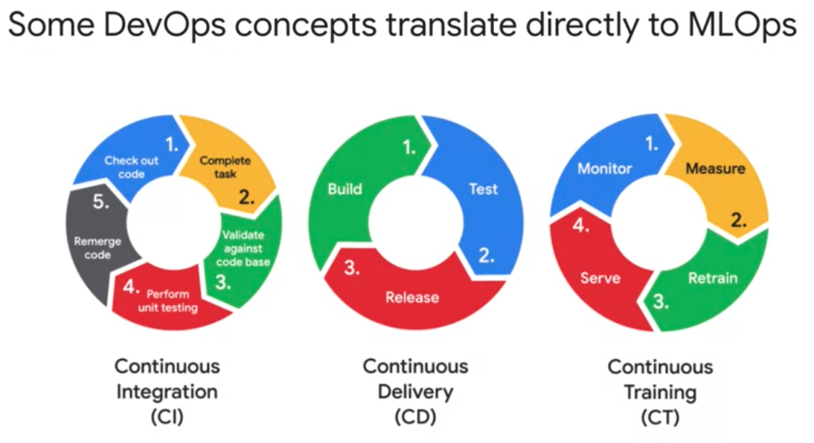
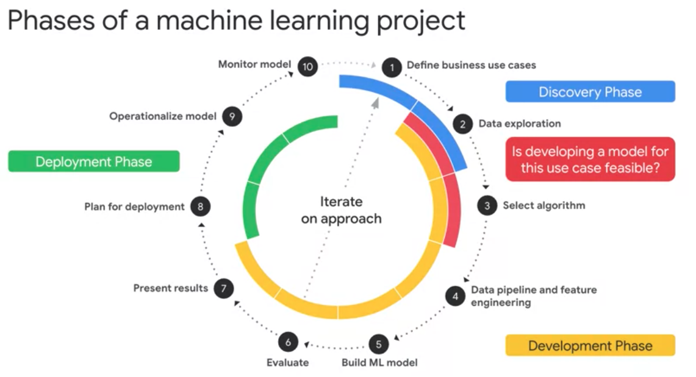
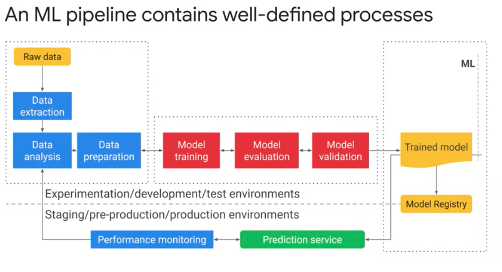

# MLOps (Machine Learning Operations) Fundamentals

In this notes we introduce machine learning operations or MLOps for short it's concepts, terminology in components. We start by providing an overview of why in when to employ MLOps. In the main pain points addresses. Then we will provide an introduction to kubernetes components such as Docker containers, pods, namespaces, clusters in container registry's. These will prepare you for a good understanding of AI pipelines using Q flow, so you will learn how to use Q flow pipelines to orchestrate the amount pipelines you build. Feel free to skip this module if you already familiar with such concepts. Then we discuss the phases of machine learning project in the context of a pipeline and also look at how to scale pipeline development with Google Cloud. Finally, we will cover Q Flow pipelines in detail, Q flow pipelines is an open source machine learning platform that was designed to enable the use of machine learning pipelines to orchestrate complicated workflows running a Kubernetes.

## Why and When to Employ MLOps

### Data Scientist's Pain Points

Let's look at machine line you from an operations perspective. This means taking a whole system view from defining the problem to scaling the solution. Let's just start by discussing the current challenges data scientists face when operationalizing their models and making them available in production. 

Some of the things we hear from data scientists are 

> "Keeping track of the meaning models we have trained is difficult"

They want to keep track of the different versions of the code, the values they chose for the different hyper parameters in the metrics they're evaluating. They have trouble keeping track of which ideas had been tried, which ones worked and which ones did not. They cannot pinpoint the best model, which is possibly trained two previously, reproduce it, and run it on full production data. 
**Reproducibility** is a major concern because there are scientists who want to be able to rerun the best model with a more through parameter sweep. 

Putting a model in production is difficult unless it can be reproduced, because many companies have that as a policy or requirements. When the team is able to successfully train a model and make it ready for production usage in a streamline fashion performance and agility are considerably improved. 

Additionally, for a production application, the model needs to be updated on a regular basis as new data comes in, so traceability becomes paramount. Given all the barriers that data scientists face today. What can be done to mitigate them? Maybe you should examine a machine learning project, the way an operations person would. In a row, you consider the whole system in terms of time, resources, and quality. How do you reduce the time between <u>analyzing the problem, creating the models and deploying the solution, while maintaining the quality of the output.</u> In software engineering, this approach called DevOps. We can borrow the term in machine learning and call it **MLOps.**

### Machine Learning Life Cycle

Think of MLOps as a lifecycle management discipline for machine learning. Its goal is a balanced process for approach to the management of resources, data, code, time, and quality to achieve business objectives in meet regulatory concerns. 

Some of the concepts from DevOps translate directly to MLOps. 

1. Continuous Integration (CI)

When software developers work on a project, they don't all work on the same code at the same time. Instead, they check out the code they intention workout from a code safe, they merge it back with their task is finished. Before the code is returned to the safe, the developer checks that nothing has changed in the main version and then unit test the updates before merging the code back together. The more frequently these changes are merged with the main code, the less chance that is of divergence. This process is called Continuous Integration or CI. In a busy development team, this happens tens of times a day.

2. Continous Delivery (CD)

Another process favored by developers is Continuous Delivery or CD. This is a method for building, testing in releasing software in short cycles. Done this way, the main development code is almost always production ready, it can be released into the light environment at anytime. If it is not done this way, the main code is like a race car with its wheels off and its engine out, you can go fast, but only after is put back together. Continuous delivery can be done either manually or automatically.

3. Continuous Training (CT)

Continuous integration of source code, unit testing, integration testing in continuous delivery of the software to production, or important processes in machine learning operations too. But there is another important aspect to MLOps, that's right, **data**. Unlike conventional software that can be relied on to do the same thing every time on the ML model, can go off. By this we mean that its projective power wins as data profile changes, which they inevitably do. So we can build on continuous integration and continuous delivery, and introducing new term Continuous Training or CT. 

Continuous training is the process of monitoring, measuring, retraining and serving the models. MLOps differs from DevOps in important ways too. Continuous integration is no longer only about testing, invalidating code and components, but also about testing and invalidating data, data schemas and models. It is no longer about a single software package or service, but a system. The ML training pipeline that should automatically deploy another service, the model prediction service. Uniquely, ML is also concerned with automatically monitoring, retraining and serving the models. Another concept that transfers well from software development machine learning is technical debt. Software developers are familiar with time, resources, and quality trade offs. They talk about technical debt, which is the backlog of free work that builds up, because sometimes they have to compromise on quality in order to develop code quickly. They understand that, although there may have been good reasons to do this, they have to go back and fix things later. This is an engineering version of the common saying, putting off until tomorrow what is better than today, there is a price to pay. Machine learning could arguably be considered the high interest credit card of technical debt. These means that developing and deploying in the ML system can be relatively fast and cheap, but maintaining it overtime can be difficult and expensive. The real challenge isn't building an ML model, it is building an integrated an ML system and continuously operating it in production. Just like a high interest credit card, that technical debt with machine learning compounds, it can be incredibly expensive and difficult to pay down. Machine learning systems can be thought of as a special type of software system. So operationally they have all the challenges of software development, plus a few of their own. Some of these include, multi-functional teams, because ML projects will probably have developers in data scientists working on data analysis, model development and experimentation. Much in functional teams can create it all management challenges. Machine learning is experimental in nature. You must constantly try new approaches with the data, the models, and parameter configuration. The challenge is tracking what worked and what didn't in maintaining reproducibility while maximising causerie usability. Another consideration is attaching and the mouse system is more involved than passing other software systems. Because you're validating data, parameters, and code together in a system instead of unit testing methods and functions. ML systems deployment isn't a simple as deploying enough line train, ML Model as production service. ML systems can require you to deploy a multistep pipeline to automatically retrain and deploy models. And finally, concerns with concept drift and consequent model decay should be addressed. Data profiles constantly change, if something changes in the data input, the projective power of the modeling production will likely change with it. Therefore you need to track summary statistics of the data and monitor the online performance of your model to send notifications, or rollback with values deviate from your expectations. Technical batch builds up in the ML system for many reasons. So we'll be looking at ways to mitigate that throughout this course.

### MLOps Architecture and TensorFlow Extended COmponents

Now it is time to go over the main phases of a machine learning lifecycle and map them to the components or tasks within MLOps. When we look at machine learning projects, we identify three main phases:

1. A discovery phase,
2. A development phase, and
3. A deployment phase. 

- **Discovery Phase**

Identifying the business need in its use case allows for a clear plan of what a machine learning model will help us achieve. This phase is crucial because it will <u>establish the problem or task that needs to be solved and how solving it will affect the business and the users consuming the product or solution argumented by machine learning.</u>

 This phase is also when data exploration happens, recognizing why datasets are needed, whether the needed data is readily available and sufficient to train a model, and whether external datasets would be beneficial and how to acquire them. 
 
 All of these are considerations that involve the data exploration step. Then, depending on the tests to be performed, an algorithm is chosen by the data science team. The combination of data availability in algorithm along with the decision of buying versus building the solution, becomes an important consideration for feasibility assessment where the team tries to uncover any problems that may arise during the development phase.
 
  One example is that for the specific use case and question, 
  
  > the data is available historically but not for inference time
  
  In that case, the particular scenario might make the use case <u>infeasible</u> for ML and the more through analysis may have to be performed before the use case can be pursued further. 
  
  Another aspect of the discovery phase is <u>prioritizing the different use cases that the business has that can become potential ML projects, but that discussion is out of the scope of this course.</u> 
  
  - **Development Phase**

  Now, for the development phase, you may ask, 
  
  - How does development start on this chart during data exploration? 
  - Shouldn't we wait until the result of the feasibility study?
  - What happens in reality is that even for data exploration and algorithms selection, some proofs of concept will need to be developed, and that is what we refer to here. After the feasibility assessment gives the go-ahead, the real development starts. 
  
  > All the data steps such as cleaning, extracting, analyzing, and transforming, will be implemented during the data pipeline creation. 
  
  The data pipeline evolves:
  
  1. ensuring that all the operation is needed on the data for both offline and streaming, for training and reference also will be performed consistently to avoid the rescue.
  2. After the data is ready, building and evaluating the model begins. I say begins because these steps may need a couple of iterations until the data scientist is happy with the results and ready to present them to the main stakeholders.
  3. Considerations include, the use case should be revisited because the learning algorithm isn't capable of identifying patterns on the data for that task. Data should be revisited because the model either needs more of it or needs additional aspects and your features maybe from the existing data. Some additional transformations are needed to improve the model quality. Or even a different algorithm is perceived as a better choice. There are numerous possibilities. This iteration will happen as many times as needed until the model reaches the desired performance. 
  
**Deployment Phase**

  After results are presented and stakeholders are satisfied with how the model is performing, it is time to plan for model deployment. This is when the following questions will likely arise. 
  
  - Which platform should host my model? 
  - Which service should I pick for model serving?
  - How many loads should the cluster have so you can scale and take care of all the demand in a cost effective manner?
  
   Operationalizing and monitoring the model will allow for maintainability and avoiding model decay, as we discussed. Having a strategy in place to detect concepts of data drifts will allow signaling when the model should be retrain or data should be adjusted or argumented. Ensuring that your pipeline considers all the necessary tasks for health checks and alerts is the most effective way to avoid your satisfaction from the user's consuming your models projections. 
   

   Focusing on the development and the deployment phases, we see that they have multiple steps. 
   
1. For data exploration, for example, that is 

    - data extraction,
    - data analysis, and
    - data preparation.

2. The model building comprise a 
    - streaming,
    - evaluation, and
    - validation. 

3. Deployment requires hosting the train model and serving it and having a prediction service ready to handle requests. 
   
4.  Monitoring to allow for continuous evaluation and training based on the performance results at a given point.

#### The level of automation of this steps define the maturity of the ML process

Which reflects the velocity of training your model is giving you data, or training your model is giving new validations. 

1. Level 0 - Build and deploy manually

    - Many ML professionals build and deploy the ML models manually. We call this maturity level zero. 
    
2. Level 1 - Automate the training phase

    - All the data scientists perform continuous training of their models by automating the ML pipeline. This is maturity Level 1. 
    
3. Level 2 - Automate training, validation, and deployment

    - Finally, the most mature approach completely automates and integrates the ML training, validation, and deployment phases. This is maturity Level 2. 
    
You and your team have probably begun or still are at maturity Level 0 and that's nothing to worry about. Our goal here is to help you automate your processes and move up the automation ladder with the suite of tools and services available at Google Cloud.

## Containers and Kuberetes

The next topic is about Kubernetes components such as docker, containers, pods, name spaces, clusters, and container registries. These concepts provide the basis to better understand later modules that talk about AI pipelines using Kubeflow, where you will learn how to orchestrate the ML pipelines you build. We understand that some of you may already know Kubernetes and GKE in great detail. Therefore, we are making this an optional module.

### Containers

#### Key features of containers 
#### The advantages of using containers for application deployment compared to alternatives such as deploying apps directly to virtual machines

A more efficient way to resolve the dependency problem is to implement abstraction at the level of the application and its dependencies. You don't have to virtualize the entire machine or even the entire operating system, but just the user space. Again, the user space is all the code that resides above the kernel, and includes the applications and their dependencies. This is what it means to create containers. Containers are isolated user spaces per running application code. 

Containers are lightweight because they don't carry a full operating system, they can be scheduled or packed tightly onto the underlying system, which is very efficient. They can be created and shut down very quickly because you're just starting and stopping the processes that make up the application and not booting up an entire VM and initializing an operating system for each application. 

You now understand containers as delivery vehicles for application code, they're lightweight, stand-alone, resource efficient, portable execution packages. You develop application code in the usual way, on desktops, laptops, and servers. The container allows you to execute your final code on VMs without worrying about software dependencies like application run times, system tools, system libraries, and other settings. You package your code with all the dependencies it needs, and the engine that executes your container, is responsible for making them available at runtime. Containers appeal to developers because they're an application-centric way to deliver high performance and scalable applications. Containers also allow developers to safely make assumptions about the underlying hardware and software. With a Linux kernel underneath, you no longer have code that works in your laptop but doesn't work in production, the container's the same and runs the same anywhere. You make incremental changes to a container based on a production image, you can deploy it very quickly with a single file copy, this speeds up your development process. Finally, containers make it easier to build applications that use the microservices design pattern. That is, loosely coupled, fine-grained components. This modular design pattern allows the operating system to scale and also upgrade components of an application without affecting the application as a whole.